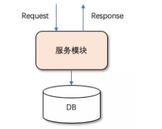
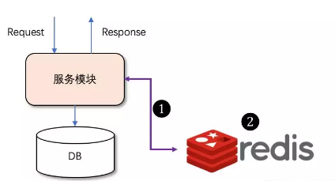

#     <center>**基于数据库实现的分布式锁** </center>
## 一、分布式锁概述
在单机时代的时候，多个线程要同时访问共享资源，我们可以采用线程间加锁或者CAS来实现线程间的资源共享，当某个线程获取到某个资源的同时立即对这个资源加锁，资源使用完毕后，释放锁，以便其他线程可以接着使用，java中并发包中有专门的处理锁的API。
但是在分布式时代，单台机器上线程间的锁机制在集群中就不能发挥作用了，集群间的资源已经不是在线程中共享了，而是属于进程间的共享资源。
为了解决这个问题，必须引入分布式锁。
目前比较常见的分布式锁实现方案有以下几种：
>1.基于数据库，如MySQL
>2.基于缓存，如Redis
>3.基于Zookeeper、etcd等

## 二、基于数据库的分布式锁的实现
在讨论使用分布式锁的时候往往首先排除掉基于数据库的方案，本能的会觉得这个方案不够“高级”。从性能的角度考虑，基于数据库的方案性能确实不够优异，整体性能对比：缓存 > Zookeeper> 数据库。很多人也提出基于数据库的方案，但很多不太可靠。但是在基于某些并发量较小的场景下，基于数据库实现的分布式锁实现相对比较简单，系统的复杂度较低。
场景描述：
某一个服务依赖下游的数据库做一些数据的读写操作,模型如下：

这里第一个图是基于数据分布式锁的图示，相对结构比较简单，服务模块中包含多实例的部署。但
通常我们可能更容易想到下边这样基于redis的实现方式。

通过以上两个图的比对，不介绍redis的正向收益，但从系统结构来看，第二个图中存在以下问题：
>1.系统的复杂度提高，需要redis的支撑。整体的数据链路边长，在出现问题的时候会阻碍故障排查以及服务恢复，从而使得服务的整体可用性下调。
>2.还需要多考虑1和2失效的情况。1失效是指服务模块与Redis的交互出现了异常，这种异常不单是指无法通信的异常，也有可能是服务模块发送请求只Redis的过程中或者Redis响应服务模块的过程中出现的异常，整体服务需要考虑这种情况：是重试、丢弃还是采取其他措施；2失效是指Redis本身出现了异常。
反观，如果采用数据库的方案，那么就可以省去了这部分的复杂度，如果数据库的方案能满足当下场景以及可视范围内的未来扩展，为什么还要平白地增加系统复杂度呢？
## 三、基于数据实现分布式锁的一些方案
下面介绍一下基于数据库实现分布式锁的一些方案，这里以mysql为例，一般分为3类：基于表记录、乐观锁和悲观锁。
### 3.1 基于表记录的实现
实现分布式锁简单的方案可能就是直接创建一张锁表，通过操作表中唯一资源来获得或释放锁，获得锁的时候就在该表中增加一条记录，想要释放的时候就删除这条记录。
参考如下：
(1).先创建一张锁表,通过唯一约束条件来获得或释放锁
```sql
CREATE TABLE `database_lock` (
    `id` BIGINT NOT NULL AUTO_INCREMENT,
    `resource` int NOT NULL COMMENT '锁定的资源',
    `description` varchar(1024) NOT NULL DEFAULT "" COMMENT '描述',
    PRIMARY KEY (`id`),
    UNIQUE KEY `uiq_idx_resource` (`resource`)
) ENGINE=InnoDB DEFAULT CHARSET=utf8mb4 COMMENT='数据库分布式锁表';
```
(2).想要获得锁，可以插入一条数据
```sql
INSERT INTO database_lock(resource, description) VALUES (1, 'lock');
```
注意：在表database_lock中，resource字段做了唯一性约束，这样如果有多个请求同时提交到数据库的话，数据库可以保证只有一个操作可以成功（其它的会报错：ERROR 1062 (23000): Duplicate entry '1' for key 'uiq_idx_resource'），那么那么我们就可以认为操作成功的那个请求获得了锁。
(3).释放锁的时候就可以删除这条记录
```sql
DELETE FROM database_lock WHERE resource=1;
```
表记录实现分布式锁的注意事项：
>1.这种锁没有失效时间，一旦释放锁的操作失败就会导致锁记录一直在数据库中，其它线程无法获得锁。这个缺陷也很好解决，比如可以做一个定时任务去定时清理。

>2.这种锁的可靠性依赖于数据库。建议设置备库，避免单点，进一步提高可靠性。

>3.这种锁是非阻塞的，因为插入数据失败之后会直接报错，想要获得锁就需要再次操作。如果需要阻塞式的，可以弄个for循环、while循环之类的，直至INSERT成功再返回。

>4.这种锁也是非可重入的，因为同一个线程在没有释放锁之前无法再次获得锁，因为数据库中已经存在同一份记录了。想要实现可重入锁，可以在数据库中添加一些字段，比如获得锁的主机信息、线程信息等，那么在再次获得锁的时候可以先查询数据，如果当前的主机信息和线程信息等能被查到的话，可以直接把锁分配给它。

### 3.2 基于乐观锁的实现
顾名思义，系统认为数据的更新在大多数情况下是不会产生冲突的，只在数据库更新操作提交的时候才对数据作冲突检测。如果检测的结果出现了与预期数据不一致的情况，则返回失败信息。
乐观锁有两种实现方案：
>1.基于数据版本(version)的记录机制实现，即为数据增加一个版本标识，在基于数据库表的版本解决方案中，一般是通过为数据库表添加一个 “version”字段来实现读取出数据时，将此版本号一同读出，之后更新时，对此版本号加1。在更新过程中，会对版本号进行比较，如果是一致的，没有发生改变，则会成功执行本次操作；如果版本号不一致，则会更新失败。
>2.借助更新时间戳（updated_at）也可以实现乐观锁，和采用version字段的方式相似：更新操作执行前线获取记录当前的更新时间，在提交更新时，检测当前更新时间是否与更新开始时获取的更新时间戳相等。

下边结合具体的案列说明：
一个电商平台都会存在商品的库存，当用户进行购买的时候就会对库存进行操作（库存减1代表已经卖出了一件）。我们将这个库存模型用下面的一张表optimistic_lock来表述，参考如下：
```sql
CREATE TABLE `optimistic_lock` (
   `id` BIGINT NOT NULL AUTO_INCREMENT,
   `resource` int NOT NULL COMMENT '锁定的资源',
   `version` int NOT NULL COMMENT '版本信息',
   `created_at` datetime COMMENT '创建时间',
   `updated_at` datetime COMMENT '更新时间',
   `deleted_at` datetime COMMENT '删除时间',
   PRIMARY KEY (`id`),
   UNIQUE KEY `uiq_idx_resource` (`resource`)
) ENGINE=InnoDB DEFAULT CHARSET=utf8mb4 COMMENT='数据库分布式锁表';
```
其中：id表示主键；resource表示具体操作的资源，在这里也就是特指库存；version表示版本号。
在使用乐观锁之前要确保表中有相应的数据，比如：
```sql
INSERT INTO optimistic_lock(resource, version, created_at, updated_at) VALUES(20, 1, CURTIME(), CURTIME());
```
在引入了version字段之后，那么具体的操作就会演变成下面的内容：
>1.获取资源： SELECT resource, version FROM optimistic_lock WHERE id = 1
>2.执行业务逻辑
>3.更新资源：UPDATE optimistic_lock SET resource = resource -1, version = version + 1 WHERE id = 1 AND version = oldVersion

借助更新时间戳（updated_at）和采用version字段的方式相似。
使用乐观锁优点和缺点：
>1.乐观锁的优点比较明显，由于在检测数据冲突时并不依赖数据库本身的锁机制，不会影响请求的性能，当产生并发且并发量较小的时候只有少部分请求会失败。
>2.缺点是需要对表的设计增加额外的字段，增加了数据库的冗余，另外，当应用并发量高的时候，version值在频繁变化，则会导致大量请求失败，影响系统的可用性。
>3。还有就是数据库锁都是作用于同一行数据记录上，这就导致一个明显的缺点，在一些特殊场景，如大促、秒杀等活动开展的时候，大量的请求同时请求同一条记录的行锁，会对数据库产生很大的写压力。

### 3.2 基于悲观锁的实现
悲观锁，与乐观锁相反，总是假设最坏的情况，它认为数据的更新在大多数情况下是会产生冲突的。
除了可以通过增删操作数据库表中的记录以外，我们还可以借助数据库中自带的锁来实现分布式锁。InnoDB引擎是支持行级锁的，在查询语句后面增加FOR UPDATE，数据库会在查询过程中给数据库表增加悲观锁，也称排他锁。当某条记录被加上悲观锁之后，其它线程也就无法在该行上增加悲观锁。
在使用悲观锁的同时，我们需要注意一下锁的级别。MySQL InnoDB引起在加锁的时候，只有明确地指定主键(或索引)的才会执行行锁 (只锁住被选取的数据)，否则MySQL 将会执行表锁(将整个数据表单给锁住)。

在使用悲观锁时，我们必须关闭MySQL数据库的自动提交属性（参考下面的示例），因为MySQL默认使用autocommit模式，也就是说，当你执行一个更新操作后，MySQL会立刻将结果进行提交。
```
mysql> SET AUTOCOMMIT = 0;
Query OK, 0 rows affected (0.00 sec)
```
这样在使用FOR UPDATE获得锁之后可以执行相应的业务逻辑，执行完之后再使用COMMIT来释放锁。
具体操作步骤：
>1.获取锁：SELECT * FROM database_lock WHERE id = 1 FOR UPDATE;。
>2.执行业务逻辑
>3.释放锁：COMMIT。
如果另一个线程B在线程A释放锁之前执行STEP1，那么它会被阻塞，直至线程A释放锁之后才能继续。注意，如果线程A长时间未释放锁，那么线程B会报错，参考如下（lock wait time可以通过innodb_lock_wait_timeout来进行配置）：
```
ERROR 1205 (HY000): Lock wait timeout exceeded; try restarting transaction
```

上面的示例中演示了指定主键并且能查询到数据的过程（触发行锁），如果查不到数据那么也就无从“锁”起了。
如果未指定主键（或者索引）且能查询到数据，那么就会触发表锁，比如STEP1改为执行（这里的version只是当做一个普通的字段来使用，与上面的乐观锁无关）：
```sql
SELECT * FROM database_lock WHERE description='lock' FOR UPDATE;
```
或者主键不明确也会触发表锁，又比如STEP1改为执行：
```sql
SELECT * FROM database_lock WHERE id>0 FOR UPDATE;
```
注意，虽然我们可以显示使用行级锁（指定可查询的主键或索引），但是MySQL会对查询进行优化，即便在条件中使用了索引字段，但是否真的使用索引来检索数据是由MySQL通过判断不同执行计划的代价来决定的，如果MySQL认为全表扫描效率更高，比如对一些很小的表，它有可能不会使用索引，在这种情况下InnoDB将使用表锁，而不是行锁。
悲观锁实现分布式的优点和缺点：
>1.在悲观锁中，每一次行数据的访问都是独占的，只有当正在访问该行数据的请求事务提交以后，其他请求才能依次访问该数据，否则将阻塞等待锁的获取。悲观锁可以严格保证数据访问的安全。
>2.缺点也明显，即每次请求都会额外产生加锁的开销且未获取到锁的请求将会阻塞等待锁的获取，在高并发环境下，容易造成大量请求阻塞，影响系统可用性。另外，悲观锁使用不当还可能产生死锁的情况。
