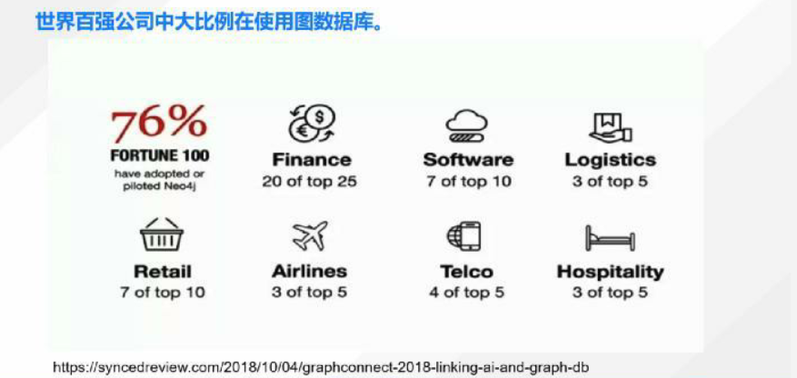
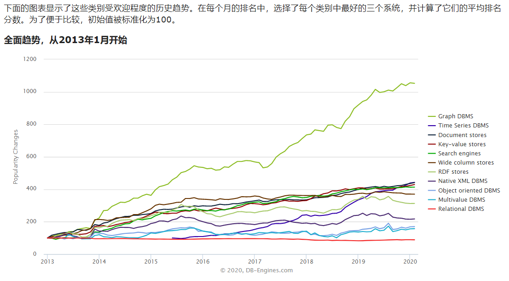

#     
**图数据库概述** 

### 1.图数据库的产生背景
当前社交、电商、金融、零售等行业在快速发展，由此用户、系统等之间产生了呈几何级数增长的数据，各种错综复杂的数据，形成了一张张庞大的关系网络。
数据激增带来的的问题是，数据内部的依赖和关系的复杂度增加，使用传统型关系数据库来保存或者使用这些复杂的数据的时候，已经显得力不从心，出现了很多难以克服的问题。NoSQL（Not Only SQL，不限于SQL）为了解决大规模数据集合多重数据种类带来的挑战，应运而生。图形数据库便是一种新型的NoSQL数据库，可以用于海量复杂的数据关系运算。

### 2.图数据库的现状
#### 2.1 世界百强公司使用图数据库报告

上图是发布于2018年的百强公司图库调研报告。据报告称，世界上百分之九十九的机票都是用Neo4j计算的，美国前二十家银行中有二十家现在使用Neo4j，从报告上看，图数据库已经广泛的应用在各个领域。以下是了解到的部分图数据库的使用情况：
* 社交领域：Facebook, Twitter，Linkedin用它来管理社交关系，实现好友推荐功能。
* 物流行业：物流行业使用图数据库解决最短路径问题来解决损失，解决一些成本问题。
* 医疗行业：一些医疗行业一个患者可能有很多疾病，有些药之间可能有相互的作用，还有个人饮食也可能和药产生冲突，这些都可以用图数据库比较好的去解决。
* 零售领域：eBay，沃尔玛使用它实现商品实时推荐，给买家更好的购物体验。
* 金融领域：金融行业用图数据库的特别多，因为金融反欺诈、金融风控可以用图来降低损。摩根大通，花旗和瑞银等银行在用图数据库做风控处理。
* 汽车制造领域：沃尔沃，戴姆勒和丰田等顶级汽车制造商依靠图数据库推动创新制造解决方案。
* 电信领域：Verizon, Orange和AT&T 等电信公司依靠图数据库来管理网络，控制访问并支持客户360。
* 酒店领域：万豪和雅高酒店等顶级酒店公司使用图数据库来管理复杂且快速变化的库存。

#### 2.2 图数据库的发展趋势

上图来自数据库评比网站DB-Engines的数据库流行趋势图，反应了各种数据库近年的受欢迎程度和增长趋势，可以看出图数据库今年还是很受欢迎的。

#### 2.3 图查询语言
对于关系型数据库来说,早已制定了标准的查询语言SQL,图数据库领域目前没有统一的查询语言,大多数的查询语言和产品本身相关，使用不同公司的图查询服务时候，需要重新学习各个产品的图查询语法。
还好在2019年9月17日，SQL标准国际委员会投票决定，将GQL作为一种新的图数据查询标准语言，独立于SQL之外。目前还没有GQL的第一实现的版本，预计为2020下半年会推出完备的草案。拥有一个统一的查询语言标准，将标志着图数据库市场的成熟度大大提高。
常见图查询语言：
>SQL:数据以表的形式存在，使用较强的较强的schema定义，表间的数据关联以join的方式连接，复杂的关联关系需要多次join操作，不够高效。

>SPARQL：面向RDF(Resource Description Framework)的三元组数据，W3C 在 2008 年发布了所谓的SPARQL协议和 RDF的查询语言 (SPARQL)，无schema，在研究中应用非常广泛。SPARQL的查询与RDF是一致的，RDF是图，SPARQL查询是子图匹配。(Neo4J支持RDF，SPARQL等扩展)

>Gremlin：数据以属性图的形式存在,可以认为是上面两种的混合体，属性仍然在表中，但是联接关系是直接以链接（比如指针）的形式存在的。查询的本质是图遍历，擅长解决求图的直径、点到点之间的路径。Gremlin 是 Apache ThinkerPop 框架下的图遍历语言。Gremlin可以是声明性的也可以是命令性的。（支持图数据库：Janus Graph、InfiniteGraph、Cosmos DB、DataStax Enterprise(5.0+) 、Amazon Neptune、百度的hugue Graph、阿里的GraphDB）

>Cypher:Neoj4数据库使用的图查询语言,一个描述性的图形查询语言，允许不必编写图形结构的遍历代码对图形存储有表现力和效率的查询，和SQL很相似。(支持图数据库： Neo4j、RedisGraph、AgensGraph)

>nGQL:Nebula Graph的查询语言，nGQL是一种类SQL的声明型的文本查询语言。Nebula 语法上和 Neo4j 接近，但并不兼容。设计时语法更接近 SQL(支持图数据库：Nebula Graph)
