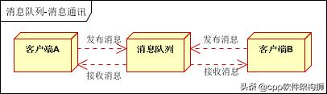

#     <center>*主流消息中间件** </center>

## 一、消息队列中间件简介
```properties
    消息队列中间件（简称消息中间件）是指利用高效可靠的消息传递机制进行与平台无关的数据交
流，并基于数据通信来进行分布式系统的集成。它提供消息传递和消息排队模型，它可以在分布式
环境下提供应用解耦、弹性伸缩、冗余存储、流量削峰、异步通信、数据同步等等功能，其作为分布
式系统架构中的一个重要组件，有着举足轻重的地位。
    消息队列作为消息中间件的一种实现方式，目前开源的消息中间件可谓百花齐放。当前我们经常
见到的有Kafka、ActiveMQ、RabbitMQ、RocketMQ、ZeroMQ等这样几款，不论是哪一款的消息队列，
都有自己的优势和劣势。至于选择哪一个消息队列用于生产，合适才是最重要的。
```

## 二、各类消息队列简述
>1.Kafka起初是由LinkedIn公司采用Scala语言开发的一个分布式、多分区、多副本且基于zookeeper协调的分布式消息系统，现已捐献给Apache基金会。它是一种高吞吐量的分布式发布订阅消息系统，以可水平扩展和高吞吐率而被广泛使用。目前越来越多的开源分布式处理系统如Cloudera、Apache Storm、Spark、Flink等都支持与Kafka集成。

>2.ActiveMQ是Apache出品的、采用Java语言编写的完全基于JMS1.1规范的面向消息的中间件，为应用程序提供高效的、可扩展的、稳定的和安全的企业级消息通信。不过由于历史原因包袱太重，目前市场份额没有后面三种消息中间件多，其最新架构被命名为Apollo，号称下一代ActiveMQ，有兴趣的同学可行了解。

>3.RabbitMQ是采用Erlang语言实现的AMQP协议的消息中间件，最初起源于金融系统，用于在分布式系统中存储转发消息。RabbitMQ发展到今天，被越来越多的人认可，这和它在可靠性、可用性、扩展性、功能丰富等方面的卓越表现是分不开的。

>4.RocketMQ是阿里开源的消息中间件，目前已经捐献个Apache基金会，它是由Java语言开发的，具备高吞吐量、高可用性、适合大规模分布式系统应用等特点，经历过双11的洗礼，实力不容小觑。

>5.ZeroMQ号称史上最快的消息队列，基于C语言开发。ZeroMQ是一个消息处理队列库，可在多线程、多内核和主机之间弹性伸缩，虽然大多数时候我们习惯将其归入消息队列家族之中，但是其和前面的几款有着本质的区别，ZeroMQ本身就不是一个消息队列服务器，更像是一组底层网络通讯库，对原有的Socket API上加上一层封装而已。

>6.目前市面上的消息中间件还有很多，比如腾讯系的PhxQueue、CMQ、CKafka，又比如基于Go语言的NSQ，有时人们也把类似Redis的产品也看做消息中间件的一种。

### 三、为什么要使用消息队列(优点)
消息队列的使用场景很多，但列出比较常见的几种场景：解耦、异步、削峰、日志处理、消息通讯
1. 解耦
（1）、这里举一个服务传统接入其他系统的例子，传统模式是这样的：

传统模式的缺点：
系统间耦合性太强，如上图所示，系统A在代码中直接调用系统B和系统C的代码，如果将来D系统接入，系统A还需要修改代码，过于麻烦！
（2）、中间件模式解耦：

中间件模式的的优点：
将消息写入消息队列，需要消息的系统自己从消息队列中订阅，从而系统A不需要做任何修改。

2. 异步
（1）、传统模式：

传统模式的缺点：
如果图中系统C和系统D互补影响，一些非必要的业务逻辑以同步的方式运行，太耗费时间。
（2）、消息中间件模式异步：

中间件模式的的优点：
将消息写入消息队列，非必要的业务逻辑以异步的方式运行，加快响应速度

3. 削峰
(1)、传统模式：

传统模式的缺点：
并发量大的时候，所有的请求直接怼到数据库，造成数据库连接异常
(2)、消息中间件模式削峰

中间件模式的的优点：
系统A慢慢的按照数据库能处理的并发量，从消息队列中慢慢拉取消息。在生产中，这个短暂的高峰期积压是允许的。

4. 日志处理
日志处理是指将消息队列用在日志处理中，比如Kafka的应用，解决大量日志传输的问题，可以参考现在流行的ELK日志处理。架构简化如下：

* 日志采集客户端，负责日志数据采集，定时写入Kafka队列；
* Kafka消息队列，负责日志数据的接收，存储和转发；
* 日志处理应用：订阅并消费kafka队列中的日志数据；

5. 消息通讯
消息通讯是指，消息队列一般都内置了高效的通信机制，因此也可以用在纯的消息通讯。比如实现点对点消息队列，或者聊天室等。
(1)点对点通讯：

客户端A和客户端B使用同一队列，进行消息通讯。
(2)聊天室通讯：

客户端A，客户端B，客户端N订阅同一主题，进行消息发布和接收。实现类似聊天室效果。
<font color="#dd00dd">以上实际是消息队列的两种消息模式，点对点或发布订阅模式。</font><br />

### 四、消息队列有什么缺点
在特殊适用的场景下，消息队列有其优势，但是消息队列的引用也有一些缺点:
1. 系统的可用性降低
>系统引入的外部依赖越多，越容易挂掉。比如本来你就是 A 系统直接调用 BCD 三个系统的接口就好了， ABCD 四个系统好好的，没啥问题，单加个 MQ 进来，万一 MQ 挂了咋整，MQ 一挂，整套系统就崩溃了。

2. 系统的复杂度提高
>硬生生加个 MQ 进来，你怎么保证消息没有重复消费？怎么处理消息丢失的情况？怎么保证消息传递的顺序性？头大头大，问题一大堆，痛苦不已。

3. 结果一致性问题
>A 系统处理完了直接返回成功了，人都以为你这个请求就成功了；但是问题是，要是 BCD 三个系统那里，BD 两个系统写库成功了，结果 C 系统写库失败了，咋整？你这数据就不一致了。

消息队列实际是一种非常复杂的架构，你引入它有很多好处，但是也得针对它带来的坏处做各种额外的技术方案和架构来规避掉，做好之后，你会发现，妈呀，系统复杂度提升了一个数量级，也许是复杂了 10 倍。但是关键时刻，用，还是得用的。

### 五、常见消息队列对比
Kafka、ActiveMQ、RabbitMQ、RocketMQ 对比：

|特性 |ActiveMQ|RabbitMQ|RocketMQ|Kafka|
|-----|--------|--------|-------|-----|
|单机吞吐量|万级，比 RocketMQ、Kafka 低一个数量级|同 ActiveMQ|10 万级，支撑高吞吐|10 万级，高吞吐，一般配合大数据类的系统来进行实时数据计算、日志采集等场景|
|topic 数量对吞吐量的影响|||topic 可以达到几百/几千的级别，吞吐量会有较小幅度的下降，这是 RocketMQ 的一大优势，在同等机器下，可以支撑大量的 topic|topic 从几十到几百个时候，吞吐量会大幅度下降，在同等机器下，Kafka 尽量保证 topic 数量不要过多，如果要支撑大规模的 topic，需要增加更多的机器资源|
|时效性|ms 级|微秒(us)级，这是 RabbitMQ 的一大特点，延迟最低|ms 级|延迟在 ms 级以内|
|可用性|高，基于主从架构实现高可用|同 ActiveMQ|非常高，分布式架构|非常高，分布式，一个数据多个副本，少数机器宕机，不会丢失数据，不会导致不可用|
|消息可靠性|有较低的概率丢失数据||经过参数优化配置，可以做到 0 丢失|同 RocketMQ|
|功能支持|MQ 领域的功能极其完备|基于 erlang 开发，并发能力很强，性能极好，延时很低|MQ 功能较为完善，还是分布式的，扩展性好|功能较为简单，主要支持简单的 MQ 功能，在大数据领域的实时计算以及日志采集被大规模使用|
|开发语言|java|erlang|java|scala|

综上，各种对比之后，有如下建议：
1. 一般的业务系统要引入 MQ，最早大家都用 ActiveMQ，但是现在确实大家用的不多了，没经过大规模吞吐量场景的验证，社区也不是很活跃，所以大家还是算了吧，我个人不推荐用这个了；

2. 后来大家开始用 RabbitMQ，但是确实 erlang 语言阻止了大量的 Java 工程师去深入研究和掌控它，对公司而言，几乎处于不可控的状态，但是确实人家是开源的，比较稳定的支持，活跃度也高；

3. 不过现在确实越来越多的公司，会去用 RocketMQ，确实很不错（阿里出品），但社区可能有突然黄掉的风险，对自己公司技术实力有绝对自信的，推荐用 RocketMQ，否则回去老老实实用 RabbitMQ 吧，人家有活跃的开源社区，绝对不会黄。

4. 所以中小型公司，技术实力较为一般，技术挑战不是特别高，用 RabbitMQ 是不错的选择；大型公司，基础架构研发实力较强，用 RocketMQ 是很好的选择。

5. 如果是大数据领域的实时计算、日志采集等场景，用 Kafka 是业内标准的，绝对没问题，社区活跃度很高，绝对不会黄，何况几乎是全世界这个领域的事实性规范。

### 六、消息队列的选型
